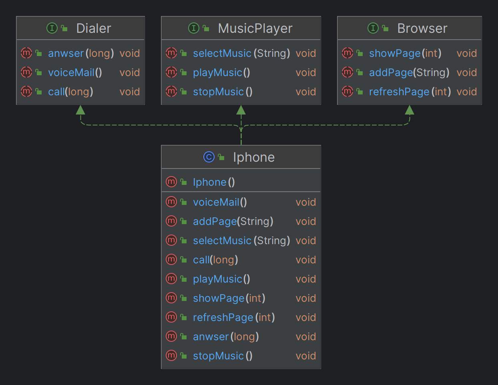

# Desafio Iphone Dio
Codigo para conclusão do desafio de compreensão de interface do bootcamp do dio

[Link para a descrição do desafio](https://github.com/digitalinnovationone/trilha-java-basico/blob/3bd8c62347d7bef0d88c793be44736193e820fca/desafios/poo/README.md)

### Estrutura UML da aplicação

